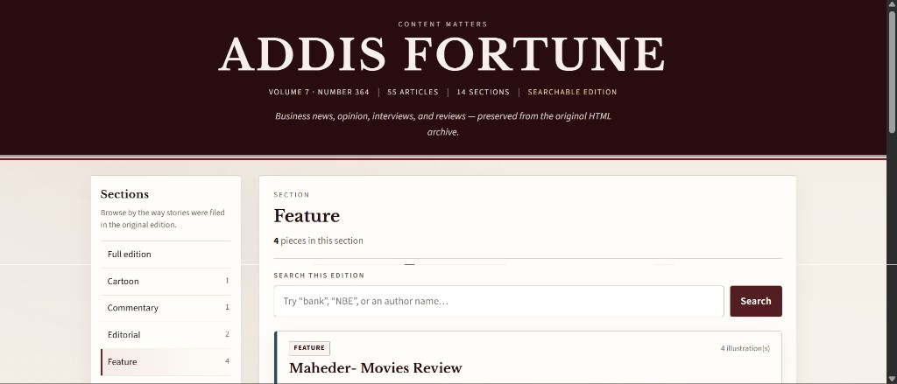
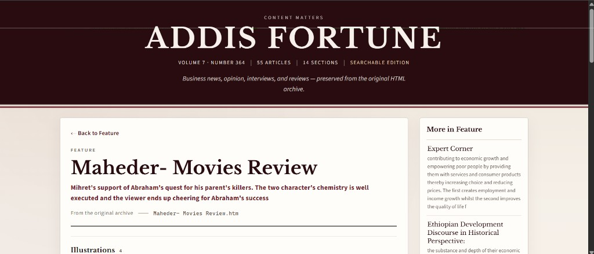
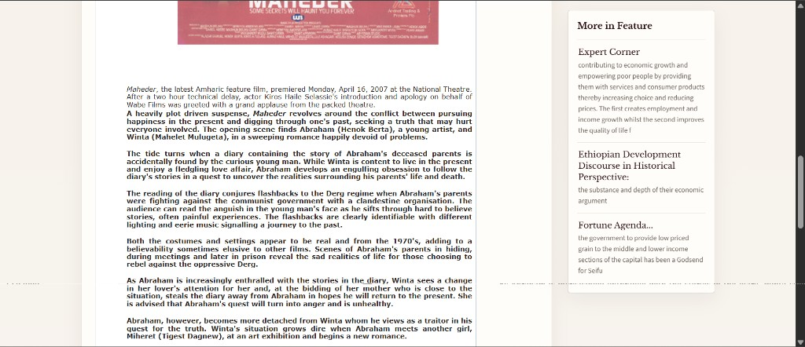

# Addis Fortune Post Extractor

A full-stack system that extracts, stores, and displays articles from the **Addis Fortune Vol 7 No 364** HTML archive.

Built for the Full-Stack Developer Technical Exam (Laravel API + React + Python).

## Preview

<p align="center">
  
</p>

<p align="center"><em>Browse 55 articles across 14 sections with full-text search</em></p>

<table>
  <tr>
    <td width="50%" align="center">
      
      <br/><sub><b>Article view</b> — title, summary, and related stories</sub>
    </td>
    <td width="50%" align="center">
      
      <br/><sub><b>Reading experience</b> — full text and illustrations from the archive</sub>
    </td>
  </tr>
</table>

## The Problem

The exam data is a legacy offline newspaper archive: dozens of `.htm` files with nested tables, Flash embeds, and inconsistent markup. There is no search, no categories API, and no modern way to read or browse the content.

## The Solution

Four cleanly separated layers:

```
┌─────────────────┐     ┌──────────────┐     ┌───────────────┐     ┌────────────────┐
│  HTML Archive   │────▶│ Python Parser│────▶│ MySQL Database│◀────│ Laravel API    │
│  (local .htm)   │     │  (ingestion) │     │  (posts)      │     │  (REST)        │
└─────────────────┘     └──────────────┘     └───────────────┘     └───────┬────────┘
                                                                            │
                                                                            ▼
                                                                   ┌────────────────┐
                                                                   │ React Frontend │
                                                                   │ (browse/search)│
                                                                   └────────────────┘
```

| Layer | Technology | Responsibility |
|-------|------------|----------------|
| **Parser** | Python 3 | Extract title, author, content, images; classify; deduplicate |
| **Database** | MySQL 8 | Store original HTML unchanged |
| **API** | Laravel 11 | Paginate, search, filter by category, serve images |
| **Frontend** | React + Vite | Browse, search, read articles |

## Repository Structure

```
html-post-extractor-system/
├── data/archive/          # HTML source (not in git — see setup below)
├── database/schema.sql    # MySQL schema
├── parser/                # Python ingestion
├── backend/               # Laravel REST API
├── frontend/              # React SPA
└── scripts/               # Helper scripts
```

---

## Prerequisites

| Tool | Version | Notes |
|------|---------|-------|
| Python | 3.10+ | Parser |
| PHP | 8.2+ | Laravel ([Laragon](https://laragon.org/) recommended on Windows) |
| Composer | 2.x | PHP dependencies |
| Node.js | 18+ | React frontend |
| MySQL | 8+ | Database with FULLTEXT support |

---

## Full Setup (step by step)

### 1. Clone and prepare data

```bash
git clone <your-repo-url>
cd html-post-extractor-system
```

Copy the exam HTML archive into `data/archive/`:

```bash
# Linux / macOS / Git Bash
bash scripts/copy-archive.sh

# Windows PowerShell
.\scripts\copy-archive.ps1
```

Or manually copy `Vol 7 No 364 Archive/` into `data/archive/`.

### 2. Create the database

```bash
mysql -u root -p < database/schema.sql
```

This creates `addis_fortune_posts` with `posts` and `post_images` tables.

### 3. Import posts (Python parser)

```bash
cd parser
pip install -r requirements.txt
cp .env.example .env          # edit DB password if needed

python main.py --dry-run -v   # preview (~61 articles)
python main.py -v             # import into MySQL
```

Re-running the parser is safe — duplicates are skipped by `source_file` and `content_hash`.

### 4. Start the Laravel API

```bash
cd backend
composer install
cp .env.example .env
php artisan key:generate
php artisan migrate             # skip if you used schema.sql
php artisan serve               # http://localhost:8000
```

Verify the API:

```bash
bash scripts/verify-api.sh
# or manually:
curl http://localhost:8000/api/posts?per_page=3
curl http://localhost:8000/api/categories
curl "http://localhost:8000/api/posts/search?q=NBE"
```

### 5. Start the React frontend

```bash
cd frontend
npm install
cp .env.example .env
npm run dev                     # http://localhost:5173
```

Open **http://localhost:5173** — browse articles, filter by category, search, and open post detail pages with images.

---

## API Endpoints

| Method | Endpoint | Description |
|--------|----------|-------------|
| `GET` | `/api/posts` | Paginated list (`?page=1&per_page=15`) |
| `GET` | `/api/posts?category=news` | Filter by category |
| `GET` | `/api/posts?q=bank` | Search on list endpoint |
| `GET` | `/api/posts/search?q=bank` | Dedicated search |
| `GET` | `/api/posts/{id}` | Single post with images |
| `GET` | `/api/categories` | Categories with counts |
| `GET` | `/archive/{path}` | Serve archive images (Laravel) |
| `GET` | `/up` | Health check |

## Frontend Routes

| Route | Page |
|-------|------|
| `/` | All articles + search |
| `/category/:slug` | Category filter |
| `/posts/:id` | Article detail + images |

---

## Environment Variables

**Parser** (`parser/.env`):

| Variable | Default |
|----------|---------|
| `DB_HOST` | `127.0.0.1` |
| `DB_DATABASE` | `addis_fortune_posts` |
| `DB_USER` / `DB_PASSWORD` | `root` / empty |

**Backend** (`backend/.env`):

| Variable | Default |
|----------|---------|
| `DB_*` | Same as above |
| `FRONTEND_URL` | `http://localhost:5173` (CORS) |

**Frontend** (`frontend/.env`):

| Variable | Default |
|----------|---------|
| `VITE_API_URL` | `http://localhost:8000/api` |
| `VITE_ARCHIVE_URL` | `/archive` (Vite dev); use `http://localhost:8000/archive` for production builds |

---

## Troubleshooting

| Symptom | Fix |
|---------|-----|
| `Database connection failed` (parser) | Start MySQL; run `schema.sql`; check `parser/.env` |
| `Could not load posts` (frontend) | Start Laravel: `php artisan serve` |
| Empty post list | Run `python main.py` in `parser/` |
| Images not loading | Ensure `data/archive/` exists; in production set `VITE_ARCHIVE_URL` |
| `php: command not found` | Install PHP via [Laragon](https://laragon.org/) or `winget install PHP.PHP.8.3` |
| CORS errors | Set `FRONTEND_URL=http://localhost:5173` in `backend/.env` |

---

## Exam Submission Checklist

- [x] README with setup instructions
- [x] Python parser (`parser/`) — free libraries only, no paid scraping
- [x] Laravel backend (`backend/`) — REST API
- [x] React frontend (`frontend/`)
- [x] Database schema (`database/schema.sql`) + Laravel migrations
- [x] Duplicate import prevention
- [x] Original content stored unchanged
- [x] Malformed HTML handled gracefully
- [x] Clean layer separation

---

## Development Roadmap

| Step | Status |
|------|--------|
| 1. Folder structure | Done |
| 2. MySQL schema / migrations | Done |
| 3. Python parser | Done |
| 4. Laravel API | Done |
| 5. React frontend | Done |
| 6. Setup docs & polish | Done |

## Source Data

**Addis Fortune Volume 7, Number 364** — business news, opinion, cartoons, interviews, news-in-brief, restaurant reviews, and more. Categories are inferred from file names and titles (e.g. `opinion.htm`, `newsinbrief.htm`, `INTERVIEW-*.htm`).


